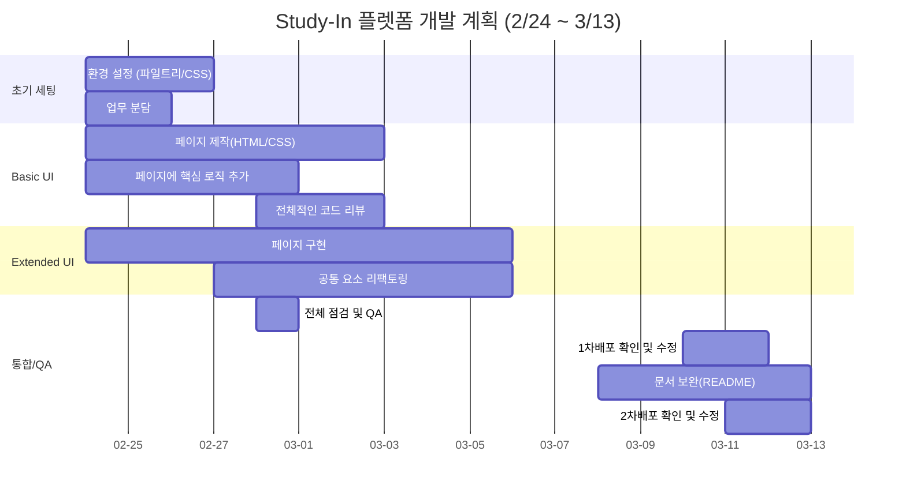
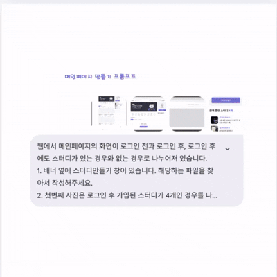
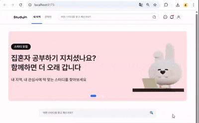
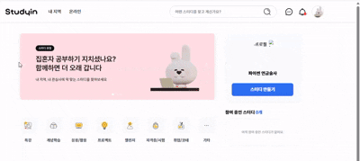
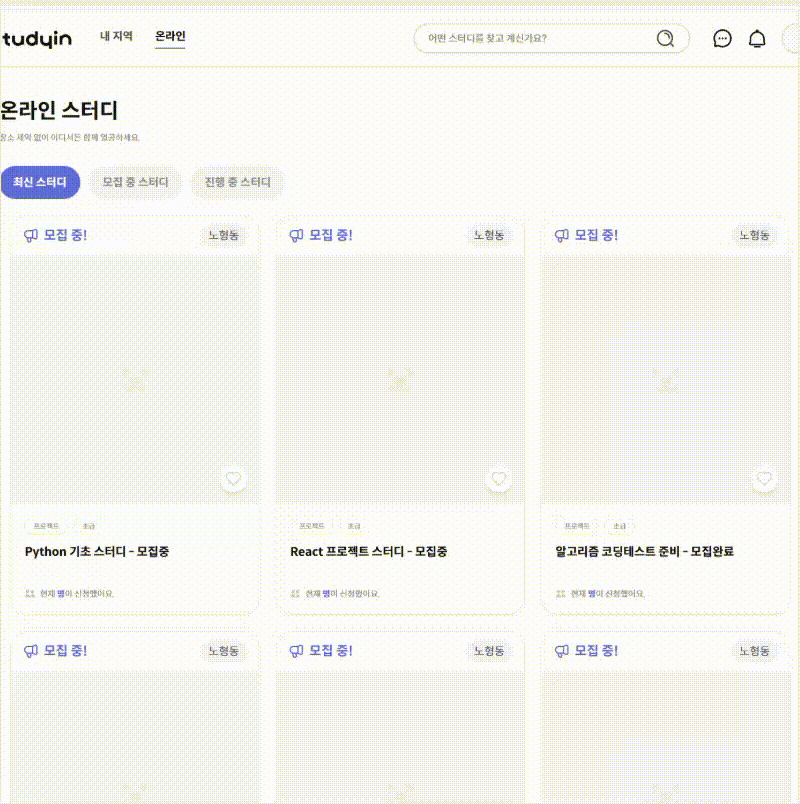

# 📖 Study-In : AI 기반 스터디 매칭 플랫폼 (Team Project 03)

## 프로젝트 개요

- **프로젝트명** : Study-In-03

- **개발 기간** : 2026.02.24 ~ 2026.03.13

- **개발 인원** : Front-End 6기 6명 (Team Project)

- **배포주소** : <https://study-in.netlify.app/>

## 1. Study-In Service

스터디인 서비스는 함께 공부할 스터디 멤버를 찾는 사람들에게 아주 유익한 스터디 매칭 플랫폼입니다.

---

### 1-1. 기업 프로젝트 배경

본 프로젝트는 **(주)위니브(WENIV)**에서 제공한 실무형 API와 피그마 디자인을 기반으로 진행된 기업 연계 프로젝트입니다. </br>
단순히 기능을 구현하는 것을 넘어, 실제 서비스 환경에서의 확장성 있는 아키텍처 설계와 AI 에이전트를 활용한 개발 생산성 극대화를 목표로 하였습니다.

---

### 1-2. 개발 목적
- ### 학습 격차 해소
  온/오프라인 스터디를 효율적으로 매칭하여 학습자 간의 정보 비대칭을 해결합니다.
- ### AI 기반 자동화
  ChatGPT API를 활용하여 번거로운 커리큘럼 작성을 자동화함으로써 사용자 경험(UX)을 혁신합니다.
- ### 실시간 소통
  WebSocket 기반의 실시간 채팅으로 커뮤니티 활성도를 높입니다.

### 1-2. 기능

- 원하는 주제와 난이도의 스터디를 개설할 수 있습니다.
- 참가 인원이나 구성 요건 등을 정하여 효율적인 학습 활동을 할 수 있습니다.
- 스터디를 직접 생성하여 스터디장이 되어 멤버를 모집할 수 있습니다.
- 관심 있는 스터디에 참가하여 함께 공부할 수도 있습니다.
- 스터디 상세 페이지에서는 스터디 정보, 일정, 참가자 목록 등을 확인할 수 있으며, 댓글을 통해 스터디장과 소통이 가능합니다.
- 참가한 스터디 내 채팅방에서 실시간으로 멤버들과 대화를 나눌 수 있습니다. 또한 스터디 참가, 댓글 등의 활동에 대한 알림을 받아볼 수 있습니다.
- 마음에 드는 스터디를 발견했다면 좋아요를 눌러 저장해두고, 검색 기능을 통해 더 쉽고 빠르게 원하는 조건의 스터디를 찾아볼 수도 있습니다.

## 2. 기술 스택(Tech Stack)

| 이름 | 역할 | 담당 기능 및 문제 해결 (Task) |
| :--- | :--- | :--- |
| **강수민** | **Leader / Infra** | JWT 인증 시스템(Interceptor), WebSocket 채팅 엔진 구축, 전역 상태(Zustand) 설계 |
| **강주현** | **AI / Search** | AI 연동 파이프라인(ChatGPT API), 다중 필터링 검색 로직 구현 |
| **최서원** | **Common UI** | 공통 모달/레이아웃 시스템, 알림(Notification) 서비스, 이미지 최적화 처리 |
| **강수정** | **Feature CRUD** | 스터디 상세 페이지(조회/참여/탈퇴), 좋아요 기능 및 데이터 정합성 관리 |
| **권하리** | **UI / Flow** | 메인 피드 및 페이지네이션, 검색어 하이라이팅 처리, 채팅 UI 인터렉션 |
| **박외숙** | **MyPage / Home** | 배너 캐러셀(Carousel), 마이페이지(프로필/관심스터디), 회원 등급 전환 로직 |

---

<br><br>

## 3. Study-In Features

<br>

| Core Features                                                                                                                                                                                                                                                                                                                                                                                                                                                                                                                                                                                | UI / UX Features                                                                                                                                                                                                                                                                                                                                                                                                                                                     | Highlighted Features                                                                                                                                                                                                                                                                                                                                                                                                                                                     |
| :------------------------------------------------------------------------------------------------------------------------------------------------------------------------------------------------------------------------------------------------------------------------------------------------------------------------------------------------------------------------------------------------------------------------------------------------------------------------------------------------------------------------------------------------------------------------------------------- | :------------------------------------------------------------------------------------------------------------------------------------------------------------------------------------------------------------------------------------------------------------------------------------------------------------------------------------------------------------------------------------------------------------------------------------------------------------------- | :----------------------------------------------------------------------------------------------------------------------------------------------------------------------------------------------------------------------------------------------------------------------------------------------------------------------------------------------------------------------------------------------------------------------------------------------------------------------- |
| **[스터디 관리]**<br>- 스터디 생성 / 수정 / 삭제 <br> - 스터디 상세 정보 조회 <br>**[스터디 참여]**<br>- 스터디 참가/ 탈퇴 <br>- 모집 상태 표시 <br>**[스터디 탐색]** <br>- **카테고리 기반 스터디 필터링**<br>- **지역 / 온라인 스터디 분류**<br>- 스터디 목록 조회<br>**[커뮤니케이션]**<br>- 스터디 게시글 댓글 작성<br>- **WebSocket 기반 실시간 채팅**<br>**[AI 지원 기능]**<br>- **AI 기반 스터디 커리큘럼 자동 생성**<br>- **AI 기반 스터디 소개글 자동 생성**<br>**[사용자 관리]**<br>- 프로필 조회 및 수정<br>- 사용자 정보 관리<br>**[인증 시스템]**<br>- **JWT 기반 로그인 인증** | **[메인배너 Carousel]**<br>- 메인 페이지 이벤트 배너<br>- 자동 슬라이드 전환<br>- 페이지 인디케이터 제공<br>**[반응형 레이아웃]**<br>- 모바일 / 태블릿 / 데스크톱 대응<br>- **스터디 카드 반응형 그리드 레이아웃**<br>**[스터디 카드 UI]**<br>- 스터디 정보 요약 카드<br>- 모집 상태 배지 표시<br>- 온라인 / 오프라인 상태 표시<br>**[페이지 라우팅]**<br>- 스터디 카드 클릭 시 **상세 페이지 이동**<br> - Local / Online 페이지 라우팅 <br><br><br><br><br><br><br> | **[카테고리 기반 스터디 필터링]** <br>- 카테고리로 필터링 기능으로 관심 있는 분야의 스터디를 빠르게 검색 <br>**[반응형 스터디 카드 레이아웃]**<br>- 이용 환경에 맞게 스터디 카드가 자동으로 재배치되는 반응형 그리드 레이아웃을 구현<br>**[메인 배너 Carousel]**<br> - 메인 페이지 3개의 배너로 Carousel UI를 구현<br>**[스터디 상태 표시]**<br> - 모집 상태와 온라인 / 오프라인 여부를 배지 형태로 표시<br><br><br><br><br><br><br><br><br><br><br><br><br><br><br><br> |

---

<br><br>

## 4. 프로젝트 관리

### 4. 1 개발 일정 (WBS)



<br>

### 4. 2 개발 작업 과정

### 4. 2. 1 사전 기획 및 요구사항 분해

- #### WBS 기반의 체계적인 업무 분배 및 난이도 조절

- #### WBS (Work Breakdown Structure)를 통한 구조적 설계

&nbsp;&nbsp;&nbsp;프로젝트 초기 단계에서 **WBS(Work Breakdown Structure)** 를 꼼꼼하게 작성하여 전체 개발 범위를 세분화했습니다.
저희 팀은 전공자(경험자)와 비전공자(초심자)가 함께하는 구성이이므로 **각 팀원의 코드 작성 역량과 기술적 이해도를 객관적으로 파악하여 업무를 분배**하는 것에 가장 큰 중점을 두었습니다.<br><br>

---

|    대분류 (Depth 1)    | 중분류 (Depth 2)  |                    세부 작업 내용 <br> (Depth 3)                    | 담당자 |         의존성 / <br>연관 파트          | 구분 |
| :--------------------: | :---------------: | :-----------------------------------------------------------------: | :----: | :-------------------------------------: | :--: |
| **0. 공통 <br>인프라** | 네트워크<br>/통신 |          JWT 관리 및 Axios 인터셉터 (토큰 자동 주입/갱신)           |   E1   |         전 파트 API 통신에 필수         | 필수 |
|                        |    UI/UX 기반     |      글로벌 레이아웃(Header, Footer) 및 공통 모달 시스템 구축       |   E3   |            전 파트 화면 뼈대            | 필수 |
|                        |     유틸리티      | 파일/이미지 업로드 API 유틸리티화 (5MB 제한, 이미지 900px 리사이징) |   E3   | 주현(썸네일), B3(프로필), E1(채팅) 사용 | 필수 |
|  **1. 회원<br>/인증**  |      로그인       |     SNS 로그인(마크업만) 및 이메일 로그인 UI/로직 (유효성 검사)     |   E1   |                    -                    | 필수 |
|                        |     회원가입      |       이메일 인증 (코드 123456 고정), 비밀번호 유효성 검사 폼       |   E1   |                    -                    | 필수 |
|                        |    초기 프로필    | 최초 가입 시 프로필 설정 화면 (이름, 폰번호, 사진, 닉네임, 지역 등) |   E1   |       E3(이미지 업로드) 함수 필요       | 필수 |
| **2. 마이<br>페이지**  |    프로필 조회    |          본인(이름, 폰번호 포함) / 타인 프로필 구분 렌더링          |   B2   |          E1(로그인 상태) 필요           | 필수 |
|                        |    프로필 수정    |             프로필 수정 폼 및 닉네임 중복 확인 API 연동             |   B2   |       E3(이미지 업로드) 함수 필요       | 필수 |
|  **3. 메인 <br>피드**  |    스터디 목록    |     스터디 카드 UI 및 메인 목록 조회 (Limit, Skip 페이지네이션)     |   B2   |                    -                    | 필수 |
|                        |   배너/필터 UI    |    상단 배너 컴포넌트 및 검색/필터 영역 UI (기능 없이 마크업만)     |   B2   |                    -                    | 필수 |
|   **4. 스터디 관리**   |    스터디 생성    |   생성 폼 UI 및 필수 입력값(모집인원, 온/오프라인 등) 유효성 검사   |   E2   |       E3(이미지 업로드) 함수 필요       | 필수 |
|                        |      AI 연동      |    ChatGPT API 활용 커리큘럼/소개글 자동 생성 (스트리밍/로딩 UI)    |   E2   |       스터디 생성 폼 내부에 부착        | 필수 |
|                        |   수정 및 삭제    |      스터디 수정(인원 축소 방지 로직) 및 삭제 기능 (모달 연동)      |   E2   |           E3(공통 모달) 필요            | 필수 |
|   **5. 스터디 상세**   |    상세 렌더링    |         스터디 정보 렌더링 및 그룹장 프로필 이동 링크 연결          |   B1   |         E2이 생성한 데이터 기반         | 필수 |
|                        |     참가/탈퇴     |            참가/탈퇴 로직 (정회원 체크, 인원 제한 체크)             |   B1   |     E1(채팅방 시스템 메세지) 트리거     | 필수 |
|                        |   좋아요(기본)    |         시각적 좋아요(하트 토글) UI 상태 변경 (API 연동 X)          |   B1   |                    -                    | 필수 |
|   **6. 스터디 소통**   |    댓글 (기본)    |        스터디 상세 페이지 하단 단일 댓글 CRUD (정회원 전용)         |   E3   |       B1(상세 페이지) 하단에 부착       | 필수 |
|  **7. 공통 <br>모달**  |    더보기 버튼    | 헤더(로그아웃 등), 상세페이지/댓글(수정, 삭제, 신고) 모달 분기 처리 |   E3   |       전 파트 모달 트리거에 적용        | 필수 |
|   **8. 심화 (선택)**   | 채팅 (Websocket)  |   채팅방 웹소켓 연결, 텍스트/이미지/파일 전송, 시스템 메세지 처리   |   E1   |   B1(참가/탈퇴 시 시스템 메세지 연동)   | 선택 |
|                        |      채팅 UI      |           채팅방 레이아웃 마크업 및 메시지 말풍선 UI 지원           |   B2   |         E1(웹소켓 로직)과 연결          | 선택 |
|                        |  검색/필터 심화   |            다중 쿼리 파라미터 조합 API 연동 및 상태 관리            |   E2   |           B2(검색 UI)과 연결            | 선택 |
|                        |     UI 고도화     |           검색어 일치 부분 강조 표시 (Highlighting) 적용            |   B2   |        E2(검색 API 데이터) 활용         | 선택 |
|                        |    댓글 고도화    |          대댓글(트리 구조), 유저 태그, 비밀 댓글 로직 처리          |   E3   |     B1(상세 페이지) 댓글 기능 대체      | 선택 |
|                        |    알림 시스템    |     참가, 댓글, 대댓글 발생 시 알림 생성 및 헤더 읽음/삭제 처리     |   E3   |   헤더(공통 UI)에 알림 드롭다운 추가    | 선택 |
|                        |   좋아요 고도화   |    실제 좋아요 API 연동 및 마이페이지 내 '관심 스터디 목록' 구현    |   B1   |        B3(마이페이지) 내 탭 추가        | 선택 |
|                        |    신고 시스템    |      스터디, 사용자, 댓글에 대한 공통 신고하기 API 및 폼 구현       |   B2   |          E3(공통 모달)에 부착           | 선택 |

---
 <div align="right"><b>*</b>&nbsp;&nbsp; E1 강수민 &nbsp;&nbsp; E2 강주현 &nbsp;&nbsp; E3 최서원 &nbsp;&nbsp; B1 강수정 &nbsp;&nbsp; B2 권하리 &nbsp;&nbsp; B3 박외숙</div> |


- #### 전공자 / 경험자 역할 (Core & Infrastructure)

초기 아키텍처 세팅, Axios 인터셉터(JWT 토큰 자동 갱신), 웹소켓(실시간 채팅), TypeScript 공통 타입 정의 등 난이도가 높은 코드
다른 도메인에 의존성을 많이 주는 '공통 인프라' 및 '심화 기능'을 주로 담당

&nbsp;&nbsp; **--> 프로젝트의 뼈대를 견고하게 잡았습니다.**

- #### 비전공자 / 초심자 역할 (UI/UX & Feature CRUD)

공통 레이아웃 마크업, 마이페이지, 스터디 피드 렌더링 등 직관적으로 화면 변화를 확인하며 React 컴포넌트 생태계에 적응할 수 있는 도메인을 우선 할당
이후 개발에 익숙해지는 속도에 맞춰 점진적으로 API 연동 및 상태 관리 로직까지 역할을 확대해 나갔습니다.

&nbsp;&nbsp; **--> 맞춤형 업무 분배를 통해 초반 개발 병목 현상을 방지**

&nbsp;&nbsp; **---->팀원 모두가 끝까지 프로젝트에 기여하며 동반 성장할 수 있는 환경 형성**

<br>

### 4. 2. 2 팀 협업 가이드 및 프로젝트 컨벤션 초기 설계

- **커밋 및 브랜치 규칙 :** `feat:`, `fix:`, `design:` 등 직관적인 커밋 메시지 프리픽스(Prefix)를 도입하여 히스토리 파악을 용이하게 했습니다.
- **코드 포맷팅 자동화 :** ESLint와 Prettier 설정을 공유하여 6명의 코드 스타일을 하나로 통일했습니다.
- **PR(Pull Request) 템플릿 도입 :** 리뷰어가 작업 맥락을 빠르게 파악할 수 있도록, PR 생성 시 '작업 내용', 'UI 변경 사항(스크린샷)', '리뷰어에게 남길 말'을 필수적으로 작성하도록 템플릿을 문서화했습니다.

#### 1. 원격 저장소 folk 후 로컬 저장소 클론

<div align="center">

```bash
git folk <https://github.com/Study-In-03/Study-In.git>
```

```bash
git clone <https://github.com/my-repository/Study-In.git>
```

</div>

#### 2. 패키지 설치

<div align="center">

```bash
npm install
```

</div>

#### 3. 환경 변수 설정

- .env 파일 생성 후 아래 내용 추가 -> .ignore 파일에 저장

<div align="center">

```bash
VITE_API_BASE_URL=https://api.wenivops.co.kr/services/studyin/
```

</div>

#### 4. 실행

<div align="center">

```bash
npm run dev
```

</div>

<br><br>

### 4. 2. 3 일일 스크럼(Daily Scrum)을 통한 실시간 진행 상황 및 블로커(Blocker) 관리

- 프로젝트 기간 동안 각 파트의 개발 속도를 맞추고 일정 지연을 방지하기 위해 **일일 스크럼(Daily Scrum)** 체제를 도입

- 매일 정해진 시간에 **'어제 완료한 작업, 오늘 진행할 작업, 현재 마주한 문제점(Blocker)'** 을 짧고 명확하게 공유했습니다.

- 기술적인 에러나 로직 구현에 어려움을 겪는 팀원이 발생하면, 스크럼 시간에 이를 즉각적으로 파악하여 경험자가 페어 프로그래밍이나 트러블 슈팅을 지원하는 등 유기적으로 대처했습니다.

- 스크럼에서 논의된 진행 유무는 즉각적으로 WBS 및 GitHub 프로젝트 보드에 반영되어, 전 팀원이 전체 프로젝트의 실시간 진행도를 투명하게 확인할 수 있었습니다.
  <br><br><br>

### 4. 2. 4 GitHub 협업 프로세스로의 고도화

- #### GitHub Issues & Git-flow를 통한 태스크 트래킹: 팀원 간 병렬로 개발 진행이 가능

```mermade
 graph LR
     A[ **GitHub Issue**로 티켓팅 ] --**Git-flow 브랜치 전략**을 엄격하게 적용--> B[ `feature/이슈번호-작업명` 형태로 브랜치 분기 ]
     graph TD
        B --> C [작업 완료 ]
        C --> D[ Pull Request를 생성 ]
        graph RL
            D --> E[ 코드 리뷰 ]
            E --3인 이상--> F[ `develop` 브랜치에 병합(Merge) ]
```

<br><br><br>

## 5. 주요 화면

## 🏠 메인 페이지

<div style="display: flex; justify-content: center; gap: 30px;">
  
  
</div>

## 🎠 배너 Carousel

<div style="display: flex; justify-content: center; gap:40px;">
  
  
</div>

##  내 지역 & 온라인 스터디 페이지

<div align="center">
 </div>

<br><br>

## 📂 프로젝트 구조

```mermade
📦 studyin-frontend
├── 📁 public/
├── 📁 src/
│   ├── 📁 api/
│   │   ├── axios.ts
│   │   ├── auth.ts
│   │   ├── study.ts
│   │   ├── profile.ts
│   │   ├── upload.ts
│   │   └── chat.ts
│   │
│   ├── 📁 assets/
│   │   ├── 📁 base/
│   │   └── 📁 category/
│   │
│   ├── 📁 components/
│   │   ├── 📁 common/
│   │   │   ├── Button.tsx
│   │   │   ├── Input.tsx
│   │   │   ├── Modal.tsx
│   │   │   └── Spinner.tsx
│   │   │
│   │   └── 📁 layout/
│   │       ├── Header.tsx
│   │       ├── Footer.tsx
│   │       ├── Layout.tsx
│   │       ├── AuthLayout.tsx
│   │       └── MobileDrawer.tsx
│   │
│   ├── 📁 constants/
│   │   └── auth.ts
│   │
│   ├── 📁 features/
│   │   ├── 📁 auth/
│   │   │   ├── 📁 components/
│   │   │   │   ├── LoginForm.tsx
│   │   │   │   ├── RegisterForm.tsx
│   │   │   │   ├── EmailVerification.tsx
│   │   │   │   └── PasswordResetForm.tsx
│   │   │   ├── 📁 hooks/
│   │   │   │   ├── useLogin.ts
│   │   │   │   ├── usePasswordResetConfirm.ts
│   │   │   │   ├── usePasswordResetEmail.ts
│   │   │   │   └── useRegister.ts
│   │   │   ├── 📁 utils/
│   │   │   │   └── authValidators.ts
│   │   │   └── index.ts
│   │   │
│   │   ├── 📁 study/
│   │   │   ├── 📁 components/
│   │   │   │   ├── StudyBanner.tsx
│   │   │   │   ├── StudyCreateTopBar.tsx
│   │   │   │   ├── StudyCard.tsx
│   │   │   │   ├── StudyList.tsx
│   │   │   │   ├── StudyFilter.tsx
│   │   │   │   ├── StudyDetailInfo.tsx
│   │   │   │   ├── LikeButton.tsx
│   │   │   │   ├── StudyForm.tsx
│   │   │   │   └── AiGeneratorButton.tsx
│   │   │   ├── 📁 hooks/
│   │   │   │   ├── useStudyList.ts
│   │   │   │   ├── useStudyForm.ts
│   │   │   │   ├── useLikeToggle.ts
│   │   │   │   └── useAiStream.ts
│   │   │   └── index.ts
│   │   │
│   │   ├── 📁 profile/
│   │   │   ├── 📁 components/
│   │   │   │   ├── ProfileCard.tsx
│   │   │   │   ├── ProfileEditForm.tsx
│   │   │   │   └── ActivityTabs.tsx
│   │   │   ├── 📁 hooks/
│   │   │   │   ├── useMyStudies.ts
│   │   │   │   └── useProfileEdit.ts
│   │   │   └── index.ts
│   │   │
│   │   ├── 📁 comments/
│   │   │   ├── 📁 components/
│   │   │   │   ├── CommentSection.tsx
│   │   │   │   ├── CommentInput.tsx
│   │   │   │   ├── CommentItem.tsx
│   │   │   │   └── RecommentList.tsx
│   │   │   ├── 📁 hooks/
│   │   │   │   └── useComments.ts
│   │   │   └── index.ts
│   │   │
│   │   └── 📁 chat/
│   │       ├── 📁 components/
│   │       │   ├── ChatRoom.tsx
│   │       │   ├── ChatMessageList.tsx
│   │       │   ├── ChatBubble.tsx
│   │       │   ├── SystemMessage.tsx
│   │       │   └── ChatInput.tsx
│   │       ├── 📁 hooks/
│   │       │   └── useWebSocket.ts
│   │       └── index.ts
│   │
│   ├── 📁 hooks/
│   │   ├── useAuth.ts
│   │   ├── useWebsocket.ts
│   │   └── useUpload.ts
│   │
│   ├── 📁 pages/
│   │   ├── Home.tsx
│   │   ├── Login.tsx
│   │   ├── Register.tsx
│   │   ├── StudyDetail.tsx
│   │   ├── StudyCreate.tsx
│   │   ├── ForgotPassword.tsx
│   │   ├── Mystudy.tsx
│   │   ├── Notification.tsx
│   │   ├── ProfileEdit.tsx
│   │   ├── ResetPassword.tsx
│   │   └── Profile.tsx
│   │
│   ├── 📁 routes/
│   │   └── Router.tsx
│   │
│   ├── 📁 store/
│   │   ├── authStore.ts
│   │   └── alertStore.ts
│   │
│   ├── 📁 types/
│   │   ├── api.d.ts
│   │   ├── user.d.ts
│   │   ├── study.d.ts
│   │   └── chat.d.ts
│   │
│   ├── 📁 utils/
│   │   ├── date.ts
│   │   ├── storage.ts
│   │   └── validation.ts
│   │
│   ├── 📁 lib/
│   │   └── firebase.ts
│   │
│   ├── App.css
│   ├── App.tsx
│   ├── index.css
│   ├── main.tsx
│   └── vite-env.d.ts
│
├── .env
├── tailwind.config.ts
├── tsconfig.json
└── package.json
```

---

### 5. 아키텍처 설계 전략

#### 1. Feature(도메인) 기반 폴더 구조

- 도메인(기능) 단위로 폴더를 분리하여 관련된 UI 컴포넌트, 커스텀 훅(비즈니스 로직), 유틸리티 함수를 한 곳에 모았습니다.
- 이를 통해 기능별 응집도를 높이고 유지보수를 용이하게 했으며, 팀원 간의 명확한 분업을 통해 병렬 개발 시 충돌을 최소화했습니다.

```text
📁 src/features/
 ├── 📁 auth/       # 로그인, 회원가입, 비밀번호 찾기 등 인증 도메인
 ├── 📁 study/      # 스터디 목록, 상세, 생성 등 스터디 도메인
 ├── 📁 profile/    # 마이페이지, 프로필 수정 도메인
 ├── 📁 comments/   # 스터디 댓글 및 대댓글 도메인
 └── 📁 chat/       # 실시간 웹소켓 채팅 도메인
```

#### 2. API 레이어 분리 및 중앙 집중화

- UI 컴포넌트 내부에서 API를 직접 호출하지 않고 서버와의 통신 로직을 별도 레이어로 분리했습니다.
- axios 인스턴스를 분리하여 헤더 설정, 에러 핸들링을 일원화했습니다.
- 인터셉터(Interceptor) 활용: 요청 시 JWT(Access Token)를 자동으로 주입하고, 401(Unauthorized) 에러 발생 시 Refresh Token을 이용해 자동으로 토큰을 갱신하도록 구성했습니다.

```text
📁 src/api/
 ├── axios.ts       # 공통 Axios 인스턴스 (인터셉터 설정 및 토큰 갱신 로직)
 ├── auth.ts        # 인증 관련 API
 ├── study.ts       # 스터디 CRUD API
 ├── profile.ts     # 프로필 관련 API
 ├── upload.ts      # 파일/이미지 업로드 API
 └── chat.ts        # 채팅 내역 조회 등 관련 API
```

#### 3. 상태 관리 전략

| 상태 유형              | 관리 방식   | 설명 및 적용 예시                                                                     |
| :--------------------- | :---------- | :------------------------------------------------------------------------------------ |
| **전역 상태 (Global)** | Zustand     | 로그인 유저 정보 및 토큰(`authStore`) 등 앱 전반에서 필요한 상태                      |
| **UI 상태 (UI/UX)**    | Zustand     | 전역 토스트, 모달 알림(`alertStore`) 등 공통 UI 제어 상태                             |
| **폼 상태 (Form)**     | Custom Hook | `useStudyForm`, `useRegister` 등 도메인별 커스텀 훅에서 입력 상태 및 검증 로직 캡슐화 |
| **서버 상태 (Server)** | Custom Hook | `useStudyList`, `useComments` 등 비즈니스 로직 훅에서 API 응답 데이터 파싱 및 관리    |

### 6. 주요 기능 (Key Features) 및 기능 시연 (Preview)

#### 6-1. 회원가입 및 로그인 (Authentication)

##### 6-1-1. JWT기반 인증

##### 6-1-2. access_token(1시간)

##### 6-1-3. refrexh_token(7시간)

##### 6-1-4. 이메일 인증 코드 : 123456

##### 6-1-5. 닉네임 중복 검사 API 연동

#### 6-2. 스터디 CRUD

##### 6-2-1. 스터디 생성

##### 6-2-2. 수정

##### 6-2-3. 삭제(스터디장만 가능)

##### 6-2-4. 상세조회

##### 6-2-5. 페이지네이션 지원

#### 6-3. AI 기능

##### 6-3-1. 커리큘럼 자동 생성

##### 6-3-2. 스터디 소개글 자동 생성

##### 6-3-3. 스트리밍 응답 처리

##### 6-3-4. 로딩 스피너 표시

##### 6-3-5. 기존 내용 덮어쓰기 전 확인 모달

#### 6-4. 실시간 채팅(WebSocket)

##### 6-4-1. JWT 토큰을 쿼리 파라미터로 전달

##### 6-4-2. 메시지 타입

###### text

###### image

###### file

###### notice

##### 6-4-3. 입/퇴장 시 시스템 메시지 자동 생성

##### 6-4-4. 매일 자정 채팅 기록 초기화

#### 6-5. 좋아요 (필수:UI 토글)

##### 6-5-1.하트 버튼 색상 변경

##### 6-5-2. 선택 과제 : 관심 스터디 목록 조회

#### 6-6. 프로필 기능

##### 6-6-1. 준회원 -> 정회원 전환

##### 6-6-2. 닉네임 중복 검사

##### 6-6-3. 선호 지역 선택

##### 6-6-4. 관심 태그 다중 선택

---

### 8. 트러블 슈팅

#### 8-1. JWT 자동 갱신 문제

##### 401 에러 발생 시 refresh요청

##### 동시 요청 race condition 방지

#### 8-2. WebSocket 재연결 문제

##### ping-pong 구현

##### 연결 끊어질 경우 재시도 로직 적용

#### 8-3. FormData 파일 업로드 이슈

##### multipart/form-data 헤더 설정

###### 이미지 자동 리사이징 대응

---

### 9. 향후 개선 사항

### 무한 스크롤 적용

#### AI 프롬프트 고도화

#### 테스트 코드 작성

#### 성능 최적화(Reactmemo, Suspense)

#### 접근성(A11y) 개선

---

### 10. 팀원 정보 및 회고


**강수민**
**(팀장)** | <https://github.com/Ssumining> | <sumin6872@naver.com>

**[ 역할 (Frontend) ]**

-
-
-
- **[ 소감 ]**

  ***


**강수정**
(팀원) | <https://github.com/sueaion> | <echomuse78@gmail.com>

**[ 역할 (프론트엔드 개발 및 UI/UX 인터랙션 구현) ]**

- 상세 페이지 동적 라우팅 및 아키텍처 설계
- 복합적인 UI 컴포넌트 및 레이아웃 구현
- 하단 고정 액션바(공유, 좋아요, 참여 버튼) 제작
- 다양한 조건에 따른 참가/탈퇴 버튼의 상태 분기 로직을 설계/ UI에 반영
- 개발 환경 최적화 및 문제 해결: Vite(PostCSS) 환경에서 발생한 @import 순서 에러를 분석 CSS 선언 우선순위를 조정함으로써 빌드 오류를 해결
- SVG 코드를 직접 사용하는 대신 프로젝트 공통 에셋(Base Icon)으로 연결
- 진행 사항을 README 및 GitHub Wiki에 문서화

 **[ 소감 ]**
"성능과 협업, 두 마리 토끼를 잡는 프론트엔드 개발의 즐거움"

이번 프로젝트에서 **'스터디 상세 페이지'**라는 핵심 도메인을 담당하며, 단순히 화면을 그리는 것을 넘어 데이터의 흐름과 사용자 시나리오를 깊이 있게 고민해 볼 수 있었습니다.

특히 기억에 남는 점은 조건부 UI 설계 과정입니다. 정회원 여부나 인원 초과 상태에 따라 버튼의 활성화 상태가 달라지는 로직을 짜면서, 프론트엔드 개발자는 사용자가 마주할 모든 예외 상황을 미리 설계해야 한다는 책임감을 느꼈습니다. 또한, 개발 초기에 발생했던 PostCSS 빌드 에러를 해결하며 CSS 명세와 번들러의 동작 원리를 이해하는 소중한 경험을 했습니다.

혼자만의 개발에 그치지 않고, 팀원들의 코드를 리뷰하며 서로의 스타일을 배우고 README를 통해 작업 내용을 투명하게 공유하는 과정에서 **'함께 성장하는 개발'**의 가치를 체감했습니다. 앞으로도 사용자에게는 매끄러운 경험을, 동료에게는 신뢰할 수 있는 코드를 주는 개발자가 되고 싶습니다.

  ***


**강주현**
(팀원) | <https://github.com/KJH1208> | <e-mail@ . >

**[ 역할 (Frontend) ]**

-
-
-
- **[ 소감 ]**

  ***


**권하리**
(팀원) | <https://github.com/psw89pxcj8-cyber> | <e-mail@ . >

**[ 역할 (Frontend) ]**

-
-
-
- **[ 소감 ]**

  ***


**박외숙**
(팀원) | <https://github.com/pahkys-prog> | <haney2001@naver.com>

**[ 역할 (Frontend) ]**

- 메인 페이지(Home) UI 구성
- StudyCard 컴포넌트 디자인 구현
- 스터디 목록 반응형 그리드 레이아웃
- 카테고리 필터 UI 및 목록 변경 로직
- LocalStudy / OnlineStudy 페이지 구현
- 스터디 카드 클릭 시 상세 페이지 라우팅 연결
- 특히 메인 페이지의 배너 영역 구현에 가장 많은 시간을 투자했습니다.
- Carousel 자동 전환
- 페이지 인디케이터
- 간단한 애니메이션 효과
- 피그마 디자인과의 UI 정합성 유지
- 스터디 카드 → 내 지역, 온라인 페이지 라우팅 연결

**[ 소감 ]**

저는 **메인 페이지(Home)** 와 **지역(Local) / 온라인(Online) 스터디 페이지**의 UI 구현과 데이터 렌더링 로직을 담당했습니다.  
비전공자로서 참여한 프로젝트였기 때문에 처음에는 코드 구조와 협업 방식이 익숙하지 않았지만, 실제 구현을 진행하면서 많은 것을 배우게 되었습니다.
사용자들이 가장 먼저 보게 되는 화면이기 때문에 **디자인을 최대한 자연스럽게 구현하는 것**에 신경을 많이 썼습니다.

가장 많은 시간을 들였던 부분은 **메인 페이지 배너 구현**이었습니다.  
피그마 디자인과 최대한 비슷한 화면을 만들기 위해 배너 이미지 교체, 자동 전환(Carousel), 페이지 인디케이터, 간단한 애니메이션 등을 적용하면서 단순한 퍼블리싱 이상의 작업을 경험할 수 있었습니다.

또한 **LocalStudy / OnlineStudy 페이지를 새로 생성하고**, 헤더 메뉴와 연결해 해당 페이지로 이동할 수 있도록 라우팅을 구성했습니다.  
이 과정에서 API 데이터를 가져오는 커스텀 훅과 연결하여 **지역 / 온라인 스터디를 필터링해 렌더링하는 구조**를 구현했습니다.

개발을 진행하면서 예상하지 못했던 문제들도 많이 만났습니다.  
Git 병합 과정에서 충돌이 발생하기도 했고, 누락된 파일이나 import 경로 문제를 찾느라 시간을 쓰기도 했습니다.  
하지만 이러한 과정을 통해 단순히 코드를 작성하는 것뿐 아니라 **협업 환경에서 코드를 관리하고 문제를 해결하는 경험**을 할 수 있었습니다.

비전공자로서 프로젝트를 시작할 때는 코드 한 줄 한 줄이 낯설었지만, 기능을 하나씩 구현하고 문제를 해결하는 과정을 반복하면서 **React 컴포넌트 구조, TypeScript 타입 정의, API 데이터 연동, 그리고 Git 협업 흐름**에 대해 조금씩 익숙해질 수 있었습니다.

아직 부족한 부분은 많지만, 이번 프로젝트를 통해 **단순히 따라 만드는 개발이 아니라 직접 고민하며 구현하는 경험**을 할 수 있었고, 앞으로 더 나은 코드를 작성하고 싶다는 동기 또한 얻을 수 있었습니다.

---


**최서원**
(팀원) | <https://github.com/swlog> | <e-mail@ . >

**[ 역할 (Frontend) ]**

-
-
-
- **[ 소감 ]**

  ***
