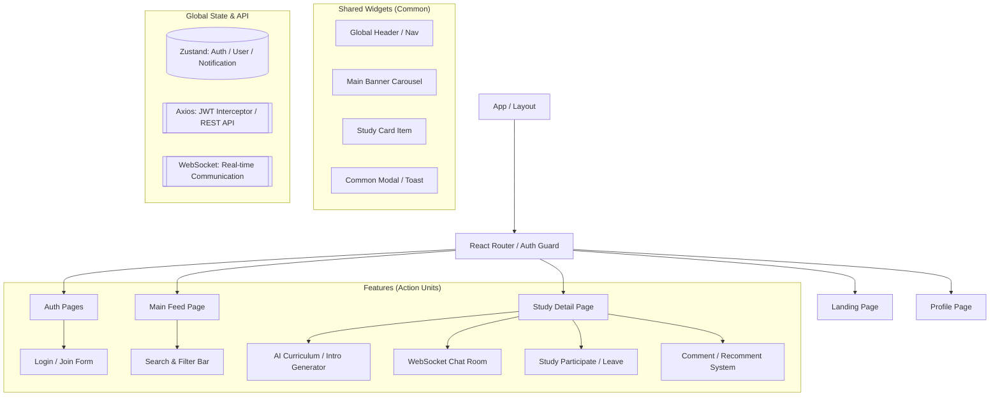
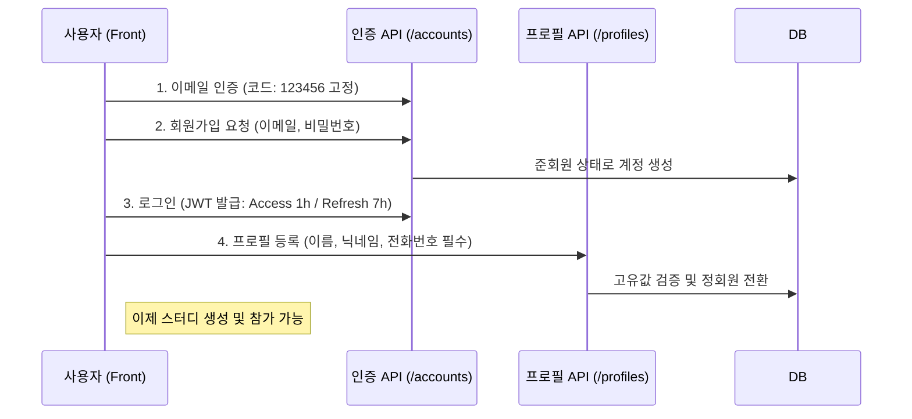
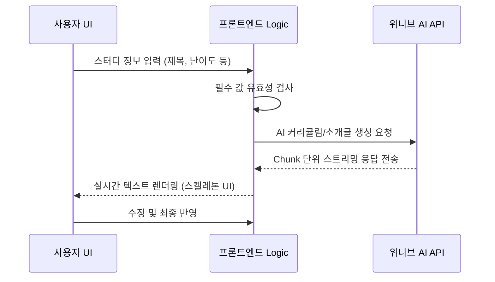
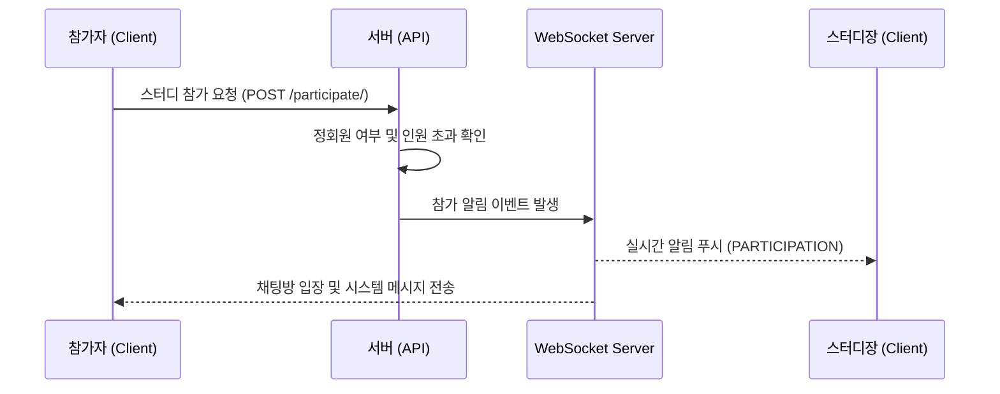
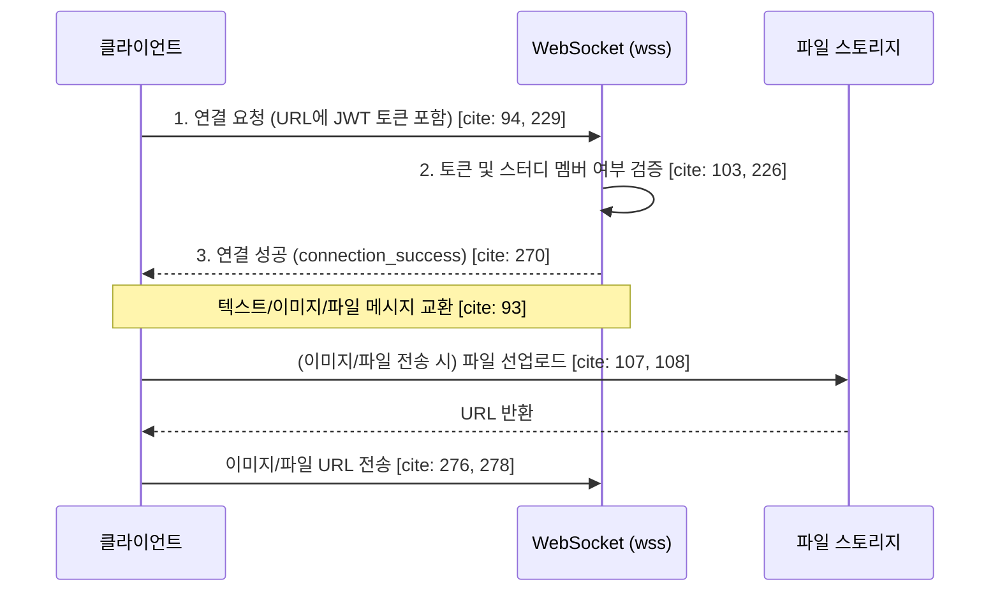
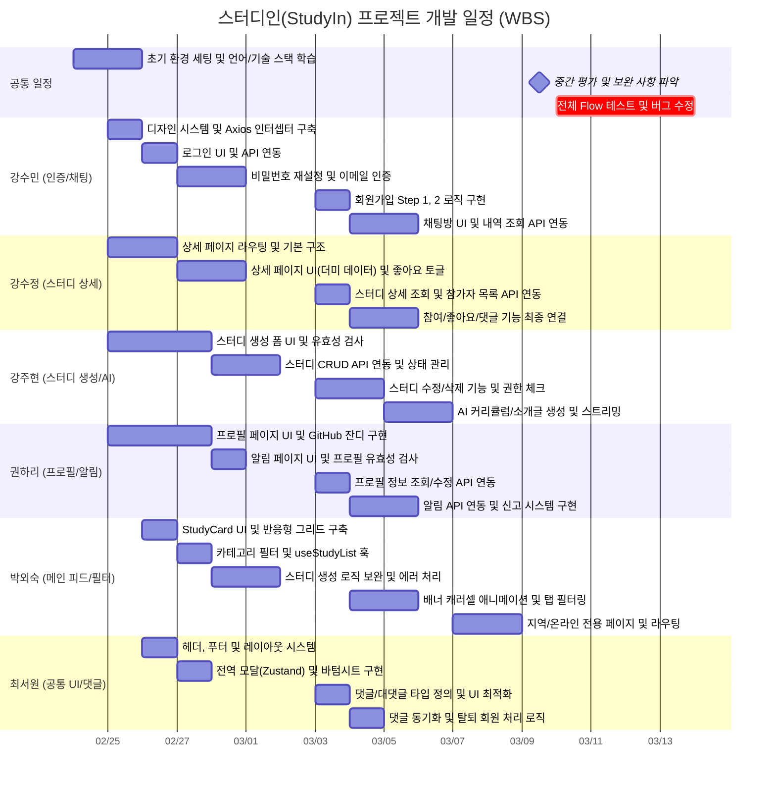

# 📖 Study-In : AI 기반 스터디 매칭 플랫폼

> **사용자의 성향과 목표를 AI로 분석하여 최적의 스터디 그룹을 연결해주는 플랫폼**

---

## 1단계: 프로젝트 요약 (The Hook)

### 1. 프로젝트 개요

| 항목 | 내용 |
| :--- | :--- |
| **프로젝트명** | Study-In (스터디-인) |
| **개발 기간** | 2026.02.24 ~ 2026.03.13 (약 3주) |
| **개발 인원** | Front-end 6명 (Team Project) |
| **배포 주소** | <https://study-in.netlify.app/> |

---

### 2. 프로젝트 소개

#### 2-1. 기업 프로젝트 배경

본 프로젝트는 **(주)위니브(WENIV)**에서 제공한 실무형 API와 피그마 디자인을 기반으로 진행된 기업 연계 프로젝트입니다. </br>
단순히 기능을 구현하는 것을 넘어, 실제 서비스 환경에서의 확장성 있는 아키텍처 설계와 AI 에이전트를 활용한 개발 생산성 극대화를 목표로 하였습니다. </br>

#### 2-2. 개발 목적

1. **학습 격차 해소:** 온/오프라인으로 수준별 맞춤 매칭을 통한 효율적인 학습 지원해 학습자 간의 정보 비대칭 해결
2. **AI 기반 자동화:** ChatGPT API를 활용하여 번거로운 커리큘럼 작성을 자동화함으로써 사용자 경험(UX) 향상
3. **실시간 소통:** WebSocket 기반의 실시간 채팅으로 커뮤니티 활성도 높임

#### 2-3. 프로젝트 목표

1. **완성도 높은 UI/UX 구현**
- 제공된 피그마(Figma) 디자인 시스템을 기반으로 모든 페이지의 UI를 정밀하게 구현
- 웹/모바일 등 다양한 환경에서 최적화된 사용자 경험을 제공
2. **견고한 인증 체계 구축:**
- JWT(JSON Web Token) 기반 인증 방식을 도입하여 보안 강화
- 회원가입 및 프로필 설정 여부에 따라 준회원과 정회원의 권한을 명확히 분리하여 관리
3. **안정적인 데이터 및 상태 관리 구현:**
- 스터디의 CRUD(생성, 조회, 수정, 삭제) 및 댓글, 좋아요 등 핵심 기능을 유기적으로 연동
- 실시간 채팅 및 알림 등 복잡한 서버 상태를 효율적으로 관리하여 끊김 없는 서비스 제공
4. **AI 연동을 통한 개인화된 큐레이션 서비스 제공:**
- 위니브 Chat GPT API를 활용하여 스터디 특성에 맞는 주차별 커리큘럼 및 소개글 자동 생성
- 가입 시 진행되는 성향 테스트 결과를 바탕으로 사용자의 학습 습관과 목표를 데이터화하여 관리

#### 2-4. 주요 기능 (Key Features)

| 분류 | 핵심 기능 | 상세 내용 | 관련 기술 (API/Spec) |
| :--- | :--- | :--- | :--- |
| **AI 스마트 생성** | **AI 콘텐츠 자동 생성** | 스터디 정보(제목, 주제, 난이도, 기간 등)를 기반으로 **AI가 커리큘럼 및 소개글을 실시간 스트리밍 방식**으로 생성합니다. | 위니브 Chat GPT API 연동 |
| **정교한 검색** | **스터디 매칭 & 필터** | 온/오프라인 여부, 지역(17종), 주제(8종), 난이도(3종), 요일 등 상세 필터를 통해 사용자 맞춤형 스터디를 탐색합니다. | Query Parameters 기반 필터링 |
| **실시간 소통** | **WebSocket 채팅** | 스터디 멤버 전용 공간에서 **WebSocket**을 통해 텍스트, 이미지, 파일을 실시간으로 공유하며 유기적으로 협업합니다. | wss 프로토콜 & JWT 인증 |
| **권한 관리** | **회원 등급 시스템** | 이메일 인증 가입 시 **준회원**이 되며, 프로필 설정(이름, 번호 고유값 등) 완료 시 **정회원**으로 승급되어 모든 기능을 사용합니다. | JWT 기반 인증 & 프로필 API |
| **상호작용** | **실시간 알림** | 내 스터디의 참가 신청, 댓글 및 대댓글 발생 등 **주요 이벤트**에 대해 실시간 알림을 생성하고 관리합니다. | REST API 기반 알림 시스템 
| **커뮤니티** | **소셜 기능** | 스터디 상세 페이지 내 **댓글 / 대댓글 작성**, 신고하기, 관심 있는 스터디 **좋아요** 저장 기능을 제공합니다. | 좋아요 & 신고/댓글 API |

#### 2-5. **주요 기능 시연**

| AI 커리큘럼 생성 | 스터디 검색 및 상세 필터 | 실시간 채팅 및 시스템 알림 |
| :---: | :---: | :---: |
|  |  |  |
| **AI 스트리밍 UI**<br>입력 데이터에 반응하여<br>커리큘럼이 실시간 생성됩니다. | **다중 조건 검색**<br>지역 및 주제별 필터로<br>맞춤형 스터디를 탐색합니다. | **실시간 소통 환경**<br>WebSocket 기반 채팅과<br>즉각적인 활동 알림을 제공합니다. |

| 회원 등급 온보딩 | 스터디 관리 (CRUD) | 소셜 및 상호작용 |
| :---: | :---: | :---: |
|  |  |  |
| **준회원 → 정회원 승급**<br>프로필 완성도에 따른<br>권한 제어를 시연합니다. | **스터디 라이프사이클**<br>스터디 생성부터 수정, 삭제까지<br>원활한 관리를 지원합니다. | **커뮤니티 활성화**<br>댓글 소통과 좋아요를 통한<br>북마크 기능을 보여줍니다. |

---

## 2단계: 기술적 역량 (The Tech)

### 1. 기술 스택 (Tech Stack)
| 역할 | 기술 | 기능 및 선정 이유 |
| :--- | :--- | :--- |
| **Core** |   | 컴포넌트 기반 SPA 개발 및 정적 타입 안정성을 확보하여 6인 협업 시 발생할 수 있는 런타임 에러를 방지 |
| **Build Tool** |  | Webpack 대비 월등히 빠른 HMR(Hot Module Replacement)과 번들링 최적화를 통해 개발 생산성을 극대화 |
| **API Comm.** |  | 인터셉터(Interceptor) 기능을 활용하여 모든 요청에 **JWT를 자동 주입**하고, 토큰 만료 시 갱신 로직을 공통화 |
| **Routing** |  | SPA 환경에서 중첩 라우팅을 구현하고, **준회원/정회원 권한**에 따른 Public/Private Route 접근 제어를 설계 |
| **Styling** |  | 유틸리티 퍼스트 기반 디자인 시스템을 구축하여, 별도의 CSS 컨벤션 논의 없이도 일관된 UI를 빠르게 구현 |
| **State** |  | Redux 대비 가벼운 보일러플레이트로 인증 상태, 알림, 모달 등 전역 상태를 직관적으로 관리 |
| **Real-time** |  | 스터디 멤버 간의 **실시간 채팅 및 시스템 알림**을 지연 없이 처리하기 위해 양방향 통신 환경을 구축 |
| **Backend** |  | 프론트엔드와 동일한 JavaScript 언어 환경에서 서버와의 데이터 인터페이스를 최적화 |
| **AI Integration**|  | 위니브 AI API를 연동하여 **커리큘럼 및 소개글 자동 생성** 기능을 구현했으며, 스트리밍 처리를 통해 UX를 개선 |
| **Collaboration**|   | Git-flow 전략을 통한 코드 협업과 Figma 디자인 시스템 준수로 기획부터 개발까지의 간극을 최소화 |
| **Deploy** |  | CI/CD 파이프라인을 구축하여 코드 수정 시 자동으로 배포되는 환경을 조성하고 SPA 정적 호스팅을 최적화 |

---

### 2. 서비스 아키텍쳐

#### 2-1. FE 구조도



#### 2-2. 데이터 흐름도

1. **회원가입 및 권한 승급 흐름 (Onboarding Flow)**

- 준회원에서 정회원으로 승급되어 스터디 기능을 활성화하는 논리적 흐름



2. **AI 콘텐츠 생성 흐름 (AI Integration Flow)**

- 사용자 입력에 따라 실시간으로 커리큘럼을 생성하고 UI에 스트리밍하는 과정



3. **스터디 참가 및 실시간 알림 흐름 (Interaction Flow)**

- 참가 신청 시 발생하는 DB 업데이트와 웹소켓 시스템 메시지 흐름



4. **실시간 채팅 통신 흐름 (WebSocket Flow)**

- 보안을 고려한 JWT 인증 기반의 실시간 채팅 데이터 흐름



---

### 3. AI 모델 연동 방식 (주현님 작성 필요)

사용자가 입력한 데이터를 바탕으로 최적의 스터디 컨텐츠를 생성하기 위해 Sequential Stream Generation 구조를 설계

**Prompt Engineering & Architecture**

- **Structured Context** <br>
AiContext 인터페이스를 통해 입력 데이터(제목, 주제, 난이도 등)의 타입을 강제 <br>
buildMessages() 함수를 통해 OpenAI Chat Completions 규격에 맞춘 메시지 배열을 동적으로 생성 <br>

- **Role-Based Prompts** <br>
목적에 따른 페르소나 분리 및 최적화

- **커리큘럼 생성** <br>
"스터디 설계 전문가" — 주차별(Week) 학습 목표 및 커리큘럼 구조화

- **소개글 생성** <br>
"소개글 작성 전문가" — 생성된 커리큘럼을 컨텍스트로 주입하여 내용의 일관성(Consistency) 확보

**Sequential AI Generation (순차적 생성 공정)**

- 단순 호출이 아닌, 데이터 간의 의존성을 고려한 순차적 흐름을 제어

- **Dependency Check** <br>
소개글 생성 요청 시 커리큘럼 존재 여부 확인

- **Auto-Chaining** <br>
커리큘럼이 없으면 **[커리큘럼 생성 → 결과 주입 → 소개글 생성]** 의 파이프라인 가동

- **Context Injection** <br>
이미 작성된 커리큘럼이 있다면 이를 참고하여 맥락에 맞는 소개글을 즉시 생성

**Streaming UI & UX Optimization**

- 네트워크 대기 시간을 체감적으로 줄이고 시각적 피드백을 강화

- **Dual-Path Streaming** <br>
    - **SSE(Server-Sent Events):** ReadableStream을 통해 choices[0].delta 청크를 실시간 파싱하여 폼 필드 업데이트
    - **Fallback Typewriter:** 일반 JSON 응답 시 simulateStream() 함수를 통해 4글자씩 점진 노출(20ms 간격)하여 일관된 UX 제공

- **Safety Confirm UX:** 
    - 기존 데이터 덮어쓰기 방지 컨펌 모달 제공
    - 상태별 버튼 UI 전환 
        - 최초 생성: ✨스파크 아이콘 / 재성성: 🔄아이콘 / 진행중: ⏳스피너

### 4. 디자인 시스템 (Design System)

**Style Guide & Tailwind Config**

- 팀원 간의 일관된 UI 구현을 위해 tailwind.config.js를 통해 디자인 토큰을 공통 변수화 <br>

1. **프레임워크 버전 선택 (Tailwind CSS v3)** <br>

- 최신 버전인 v4 대신 v3를 채택하여 프로젝트 진행 <br>
v- 4에서 공통 변수 지정 및 테마 확장 방식이 변경됨에 따라 발생할 수 있는 팀원 간의 설정 혼선을 방지하고, 모두가 동일하고 안정적인 개발 환경에서 협업하기 위함 <br>

2. **레이아웃 시스템** <br>

- 모바일/태블릿 전환 기준(md: 834px)과 웹 컨텐츠 최대 너비(lg: 1190px)를 사전에 정의하여 반응형 대응을 표준화 <br>

3. **Typography** <br>

- Spoqa Han Sans Neo를 메인 폰트로 설정 <br>
- 7단계의 폰트 사이즈와 3단계의 굵기(400, 500, 700)를 변수화하여 가독성 높임 <br>

4. **Color Palette** <br>
- 서비스의 정체성을 나타내는 Primary(#2E6FF2) 색상을 필두로, 에러(FF3440), 경고(FFC533), 그리고 5단계의 그레이스케일을 지정하여 코드의 재사용성을 극대

**Common Components** 
- src/components 폴더 내에 공통 컴포넌트를 구축하여 UI 일관성을 유지하고 중복 코드를 최소화

1. **common/ (원자 단위 컴포넌트)**

- **Button.tsx, Input.tsx** <br>
서비스 전반에서 사용되는 핵심 인터랙션 요소 <br>
다양한 상태(Hover, Active, Disabled)를 공통으로 관리 <br>

- **Modal.tsx, ReportModal.tsx, UserInfoModal.tsx** <br>
명세서에 명시된 신고 기능 및 프로필 확인 기능을 위해 범용 모달 시스템을 구축 <br>

- **Snackbar.tsx, Spinner.tsx** <br>
AI 콘텐츠 생성 시의 로딩 상태나 사용자 피드백(알림)을 시각적으로 전달하는 공통 UI <br>

2. **layout/ (구조 단위 컴포넌트)** <br>

- **Header.tsx, Footer.tsx**
전역 내비게이션과 푸터를 공통화하여 페이지 전환 시에도 사용자 경험을 유지 <br>

- **AuthLayout.tsx, ChatLayout.tsx**
로그인/회원가입의 인증 절차와 실시간 채팅을 위한 전용 레이아웃을 분리하여 설계 <br>

- **MobileDrawer.tsx** 
모바일 환경에서의 내비게이션 편의성을 위해 드로어 컴포넌트를 별도로 관리

---

## 3단계: 프로젝트 관리 & 설계 (The Process)

### 1. 프로젝트 관리

#### 1-1. 팀원들 역할 분담

- 6명의 프론트엔드 개발자가 도메인별로 책임을 나누어 개발을 진행 <br>
- 공통 유틸리티와 전역 상태를 공유하여 효율적으로 협업 <br>

| 이름 | 역할 | 담당 업무 (R&R) | 연관(의존) 파트 |
| :---: | :---: | :--- | :--- |
| **수민** | **Auth & Real-time** | • **인증/인가**: JWT 기반 로그인/회원가입 및 Axios 인터셉터 설정 <br> • **온보딩**: 이메일 인증(코드 123456)부터 프로필 설정 플로우 담당 <br> • **실시간 채팅**: **WebSocket** 기반 실시간 채팅방 및 메시지 타입 처리 | 프로젝트 전체의 '로그인 상태'를 관리하여 모든 팀원에게 데이터 제공 |
| **주현** | **Study & AI Search** | • **스터디 관리**: 스터디 CRUD 및 3명~99명 모집 인원 유효성 관리 <br> • **AI 연동**: ChatGPT API 스트리밍 응답 기반 커리큘럼/소개글 자동 생성 <br> • **심화 탐색**: 쿼리 파라미터를 활용한 **다중 필터링** 및 검색 기능 구현 | 생성된 스터디 데이터를 상세 페이지(수정) 및 메인 피드(외숙)와 연결 |
| **서원** | **Infrastructure & Social** | • **기초 공사**: 글로벌 모달 시스템 및 헤더/푸터 공통 레이아웃 설계 <br> • **커뮤니티 고도화**: **대댓글(태그 기능)** 및 비밀 댓글 로직 처리 <br> • **알림 시스템**: 스터디 참가/댓글 발생 시 **실시간 알림(Notification)** 구축 | 파일 업로드 유틸리티를 팀원(주현, 하리)에게 배포 및 헤더 내 알림 연동 |
| **수정** | **Contents & Interest** | • **상세 페이지**: 스터디 정보 렌더링 및 참가/탈퇴 시스템 메시지 연동 <br> • **관심 서비스**: **좋아요 API** 연동(토글) 및 마이페이지 내 관심 목록 구현 <br> • **UI 인터랙션**: 하트 버튼의 시각적 상태 변화 및 스터디장 프로필 링크 연결 | 서원이 만든 댓글 컴포넌트를 상세 페이지에 부착 및 좋아요 상태 공유 |
| **하리** | **Profile & Report** | • **사용자 도메인**: 본인/타인 프로필 조회 구분 및 닉네임 중복 체크 API 연동 <br> • **프로필 관리**: **준회원→정회원 승급** 조건(필수값 입력) 및 정보 수정 구현 <br> • **신고 시스템**: 스터디/유저/댓글 대상 **공통 신고 모달 폼** 구축 | 서원의 업로드 함수로 프로필 사진 처리 및 공통 신고 시스템 팀 내 배포 |
| **외숙** | **Main Feed & Highlighting** | • **메인 인프라**: 홈 화면 카드 UI 및 **페이지네이션(Limit/Skip)** 데이터 로드 <br> • **UI 고도화**: 검색어 일치 부분 **강조 표시(Highlighting)** 및 배너 연동 <br> • **레이아웃 지원**: 수민의 채팅방 마크업 지원 및 검색 결과 필터 UI 최적화 | 주현이 설계한 다중 쿼리 API 데이터를 받아 메인 검색 결과 화면 렌더링 |

---

#### 1-2. 개발 작업 과정

1. **요구사항 분해 및 역할 분배** 

- 프로젝트의 성공적인 완수를 위해 전공자(경험자)와 비전공자(초심자)의 기술적 이해도를 고려한 전략적 요구사항 분해를 실시 <br>
- 단순히 기능을 나누는 것에 그치지 않고, 각 기능의 의존성(Dependency)과 구현 난이도를 분석하여 팀원 모두가 성장하며 병목 현상 없이 개발에 집중할 수 있도록 설계

**Core & Infrastructure (전공자/경험자 중심)**

- 초기 아키텍처 세팅 및 Axios 인터셉터(JWT 자동 주입/갱신) 등 프로젝트의 기반 설계
- 웹소켓(실시간 채팅), AI 스트리밍 UI 등 난이도가 높은 심화 기능을 선행 개발하여 팀원들에게 공통 모듈 제공.
- **성과:** 프로젝트의 뼈대를 견고하게 잡아 기술적 결함을 최소화

**Feature & UI/UX (비전공자/초심자 중심)**

- 컴포넌트 기반 SPA 개발 방식에 적응할 수 있도록 직관적인 UI 렌더링 및 CRUD 도메인을 우선 
- 할당.공통 레이아웃, 마이페이지, 스터디 피드 등 화면 변화를 즉각적으로 확인할 수 있는 파트부터 시작하여 점진적으로 API 연동으로 확대
- **성과:** 초반 개발 진입 장벽을 낮추어 팀원 모두가 끝까지 기여하는 동반 성장을 이끌어냄

**개발 일정 (WBS)**

사전 기획 단계에서 수립한 WBS를 바탕으로 필수 기능과 심화 기능을 구분하여 체계적으로 일정을 관리했습니다.

**1. 공통 및 핵심 기능 (Must-Have)**

| 대분류 | 중분류 | 세부 작업 내용 (Depth 3) | 담당자 | 의존성 / 연관 파트 | 구분 |
| :--- | :--- | :--- | :---: | :--- | :---: |
| **0. 공통 인프라** | 네트워크/통신 | JWT 관리 및 Axios 인터셉터 (토큰 자동 주입/갱신) | **수민** | 전 파트 API 통신 필수 | 필수 |
| | UI/UX 기반 | 글로벌 레이아웃(Header, Footer) 및 공통 모달 시스템 구축 | **서원** | 전 파트 화면 뼈대 | 필수 |
| | 유틸리티 | 파일/이미지 업로드 API 유틸리티화 (5MB 제한, 900px 리사이징) | **서원** | 주현, 하리, 수민 공통 사용 | 필수 |
| **1. 회원/인증** | 로그인 | SNS 로그인(마크업) 및 이메일 로그인 UI/로직 (유효성 검사) | **수민** | - | 필수 |
| | 회원가입 | 이메일 인증 (코드 123456 고정), 비밀번호 유효성 폼 | **수민** | - | 필수 |
| | 초기 프로필 | 최초 가입 시 프로필 설정 (이름, 폰번호, 사진, 닉네임 등) | **수민** | 서원(이미지 업로드) 유틸 활용 | 필수 |
| **2. 마이페이지** | 프로필 조회 | 본인 및 타인 프로필 구분 렌더링 | **하리** | 수민(로그인 상태) 기반 | 필수 |
| | 프로필 수정 | 프로필 수정 폼 및 닉네임 중복 확인 API 연동 | **하리** | 서원(이미지 업로드) 유틸 활용 | 필수 |
| **3. 메인 피드** | 스터디 목록 | 스터디 카드 UI 및 메인 목록 조회 (Pagination) | **외숙** | - | 필수 |
| | 배너/필터 | 상단 배너 및 검색/필터 영역 UI (마크업) | **외숙** | - | 필수 |
| **4. 스터디 관리** | 스터디 생성 | 생성 폼 UI 및 필수 입력값 유효성 검사 | **주현** | 서원(이미지 업로드) 유틸 활용 | 필수 |
| | AI 연동 | ChatGPT API 활용 커리큘럼/소개글 자동 생성 (Streaming) | **주현** | 스터디 생성 폼 내 삽입 | 필수 |
| | 수정/삭제 | 스터디 수정(인원 축소 방지) 및 삭제 기능 (모달 연동) | **주현** | 서원(공통 모달) 활용 | 필수 |
| **5. 스터디 상세** | 상세 렌더링 | 스터디 정보 렌더링 및 그룹장 프로필 이동 연결 | **수정** | 주현(생성 데이터) 기반 | 필수 |
| | 참가/탈퇴 | 참가/탈퇴 로직 (정회원/인원 제한 체크) | **수정** | 수민(채팅 시스템 메세지) 트리거 | 필수 |
| | 좋아요(기본) | 시각적 좋아요(하트 토글) UI 상태 변경 (Local Only) | **수정** | - | 필수 |
| **6. 스터디 소통** | 댓글 (기본) | 스터디 상세 페이지 하단 단일 댓글 CRUD (정회원 전용) | **서원** | 수정(상세 페이지) 하단 부착 | 필수 |
| **7. 공통 모달** | 더보기 버튼 | 헤더(로그아웃), 상세/댓글(수정, 삭제, 신고) 모달 분기 | **서원** | 전 파트 모달 트리거 적용 | 필수 |

---
<br>

**2. 심화 및 선택 구현 기능 (Nice-to-Have)**

<br>

| 대분류 | 세부 작업 내용 (Depth 3) | 담당자 | 연관 파트 | 구분 |
| :--- | :--- | :---: | :--- | :---: |
| **8. 심화 선택** | 채팅방 웹소켓 연결 및 텍스트/이미지/파일 전송 | **수민** | 수정(참가/탈퇴 메세지) | 선택 |
| | 채팅방 레이아웃 및 메시지 말풍선 UI | **외숙** | 수민(웹소켓 로직) | 선택 |
| | 다중 쿼리 파라미터 조합 API 연동 및 상태 관리 | **주현** | 외숙(검색 UI) | 선택 |
| | 검색어 일치 부분 강조 표시 (Highlighting) | **외숙** | 주현(검색 API 데이터) | 선택 |
| | 대댓글(트리 구조), 유저 태그, 비밀 댓글 로직 | **서원** | 수정(상세 페이지) | 선택 |
| | 알림 시스템 (참가, 댓글 발생 시 헤더 알림) | **서원** | 헤더(공통 UI) | 선택 |
| | 실제 좋아요 API 연동 및 마이페이지 내 관심 목록 | **수정** | 하리(마이페이지) | 선택 |
| | 스터디, 사용자, 댓글 신고 API 및 폼 구현 | **하리** | 서원(공통 모달) | 선택 |

---

2. **협업 컨벤션:**

- **팀 협업 가이드 및 프로젝트 컨벤션 확립** <br>
효율적인 협업과 코드 품질 유지를 위해 모든 팀원이 준수해야 할 핵심 가이드라인 확립

<팀 협업 가이드 및 프로젝트 컨벤션 사진>

- **브랜치 전략 작성 및 적용** <br>
프로젝트의 안정성과 병렬 개발을 위해 Git-flow 모델을 기반으로 운영

<브랜치 전략 사진>

- **커밋 메시지 규칙 (Commit Convention) 확립** <br>
`Prefix: #이슈번호 - 작업내용` 형식 준수 및 Git-flow 적용

<커밋 메시지 컨벤션 사진>

- **PR(Pull Request) 및 코드 리뷰 프로세스 확립** <br>
`main` <- `develop` <- `feature/#이슈번호` <br>
모든 팀원은 PR을 통해 코드에 기여하며, 상호 승인 제도를 운영

**협업 프로세스 흐름도**
1. **Issue 생성:** 작업 전 GitHub Issues에 태스크 등록 (이슈 번호 생성).
2. **브랜치 생성:** develop에서 feature/#이슈번호-작업명 분기.
3. **작업 및 커밋:** 컨벤션에 맞춰 커밋 후 Push.
4. **PR 생성:** 정해진 템플릿에 맞춰 develop 방향으로 PR 생성.
5. **코드 리뷰:** 최소 2인 이상의 Approve가 있어야 Merge 가능.
6. **Merge & 삭제:** 승인 후 병합하며, 사용이 끝난 feature 브랜치는 삭제.

**PR 작성 템플릿**

<pr 작성 템플릿 사진>

```mermade
 graph LR
     A[ **GitHub Issue**로 티켓팅 ] --**Git-flow 브랜치 전략**을 엄격하게 적용--> B[ `feature/이슈번호-작업명` 형태로 브랜치 분기 ]
     graph TD
        B --> C [작업 완료 ]
        C --> D[ Pull Request를 생성 ]
        graph RL
            D --> E[ 코드 리뷰 ]
            E --3인 이상--> F[ `develop` 브랜치에 병합(Merge) ]
```

- **코드 품질 및 자동화 (Code Quality)** <br>

- 환경 설정 : ESLint와 Prettier 설정을 공유하여 일관된 포맷 유지 <br>
- Husky & Lint-staged : 커밋 전 코드 포맷팅 자동 검사를 실시하여 컨벤션을 어긴 코드는 Push를 차단 <br>
- 코드 주석 : 복잡하거나 생소한 로직에는 동료 개발자를 위한 상세 주석 작성을 권장 <br>

- **일일스크럼** 

- 프로젝트 지연을 방지하고 유기적인 협업을 위해 일일 스크럼을 운영
- 시간 : 매일 오전 (약 10~15분 내외)과 오후 (끝나기 10분 전)
- 이슈가 마무리되면 GitHub Issues와 Kanban 보드를 활용한 태스크 가시화

- **공유 내용**
- 1. 어제 완료한 작업 : 실제 진행된 태스크
- 2. 오늘 진행할 작업 : 우선순위 기반의 To-do 리스트
- 3. 현재 마주한 문제점(Blocker) : 기술적 에러나 일정 지연 요소

<일일 스크럼 작성한 사진>

<깃헙 칸반 보드 사진>

- **팀원을 위한 가이드 wiki 작성** <br>

<GitHub Projects & Issues 사용법 사진>
<자주 사용하는 Git 명령어 모음집 사진>

3. **일정 관리 (WBS):**



### 2. 페이지 구조

- 본 프로젝트는 react-router-dom을 기반으로 공통 레이아웃과 접근 권한(Public/Private)을 분리하여 관리

**사용자 접근 권한 및 레이아웃 구조**

- **공통 레이아웃 (Layout):** 헤더와 푸터를 포함하며, 서비스의 기본 뼈대 구성
- **인증 레이아웃 (AuthLayout):** 로그인, 회원가입 등 계정 관련 페이지 전용 레이아웃
- **채팅 레이아웃 (ChatLayout):** 실시간 소통을 위한 채팅 페이지 전용 레이아웃
- **접근 제한 (PrivateRoute):** 로그인(JWT 토큰 보유) 상태인 정회원만 접근 가능한 보호된 라우트

<br>

| 페이지명 | 경로 (Path) | 주요 기능 및 특징 | 담당자 | 관련 API 도메인 |
| :--- | :--- | :--- | :--- | :--- |
| 메인 홈 | `/` | 스터디 목록 조회(Pagination), 배너 및 필터 UI | 외숙 | `/study/` |
| 검색 결과 | `/search` | 다중 필터 및 키워드 기반 스터디 검색 | 주현, 외숙 | `/study/list/` |
| 로그인 | `/login` | 이메일 기반 JWT 인증 (Access/Refresh) | 수민 | `/accounts/login/` |
| 회원가입 | `/register` | 이메일 인증(123456) 및 비밀번호 설정 | 수민 | `/accounts/register/` |
| 스터디 상세 | `/study/:studyId` | 정보 렌더링, 참가/탈퇴, 댓글 CRUD | 수정, 서원 | `/study/{id}/` |
| 스터디 생성 | `/study/create` | 정회원 전용, AI 커리큘럼/소개글 자동 생성 | 주현 | `/study/` (POST) |
| 스터디 수정 | `/study/:id/edit` | 기존 정보 수정 및 인원 축소 방지 로직 | 주현 | `/study/{id}/` (PUT) |
| 마이페이지 | `/profile` | 내 활동(참여/관심) 및 프로필 정보 조회 | 하리 | `/accounts/profiles/` |
| 프로필 설정 | `/profile/edit` | 닉네임 중복 확인 및 프로필 정보 수정 | 하리 | `/accounts/profiles/` (PUT) |
| 실시간 채팅 | `/chat/:id` | WebSocket 기반 메시지/파일/이미지 송수신 | 수민, 외숙 | `wss://.../chat/` |
| 알림 센터 | `/notification` | 참가/댓글/대댓글 발생 시 실시간 알림 확인 | 서원 | `/notifications/` |

### 3. 폴더 구조

<코드 마지막까지 작성후 폴더 정리 후 폴더 구조>

### 4. 사용자 시나리오 (사용자 여정 지도)

### 1. 회원가입/로그인 및 프로필 설정

**"서비스의 첫인상을 결정하고 정회원으로 거듭나는 과정"**

| 단계 | 서비스 인지 | 회원가입 / 로그인 | 최초 접속 | 프로필 설정 (정회원 전환) |
| :--- | :--- | :--- | :--- | :--- |
| **사용자 행동** | 서비스 정보 습득 및 가입 결심 | 이메일/비번 입력 및 인증 | 로그인 후 메인 피드 진입 | 마이페이지 이동 및 필수 정보 입력 |
| **관련 API** | - | `POST /api/register`<br>`POST /api/login` | `GET /api/user/me` | `PUT /api/user/profile` |
| **생각 및 감정** | "나에게 도움이 될까?" (기대 반, 의심 반) | "절차가 간단했으면 좋겠다." (신속함 기대) | "성공! 이제 시작이다." (안도감) | "나를 어떻게 표현할까?" (고민, 만족감) |
| **비고** | 광고, 지인 추천 등 | - | 로그인 PK 획득 및 저장 | 닉네임, 전화번호 중복 체크 필수 |

---

### 2. 콘텐츠 조회 및 검색

**"나에게 딱 맞는 스터디 정보를 탐색하고 발견하는 과정"**

| 단계 | 메인 화면 접속 | 목록 탐색 | 상세 조회 | 검색 및 필터링 |
| :--- | :--- | :--- | :--- | :--- |
| **사용자 행동** | 전체 스터디 피드 확인 | 스크롤 및 카테고리 필터링 | 특정 스터디 클릭 및 내용 확인 | 키워드 검색 및 상세 조건 설정 |
| **관련 API** | `GET /api/contents` | `GET /api/contents?category=...` | `GET /api/contents/{id}` | `GET /api/contents/search?q={query}` |
| **생각 및 감정** | "새로운 소식이 뭐가 있지?" (호기심) | "재미있는 게 있을까?" (기대) | "이 내용은 유익하네!" (몰입) | "내가 찾는 게 나와야 할 텐데." (집중) |
| **비고** | 배너 섹션 확인 가능 | 무한 스크롤 또는 페이지네이션 | 댓글 및 대댓글 조회 포함 | 난이도, 요일, 온/오프라인 필터 |

---

### 3. 콘텐츠 작성 및 관리

**"직접 스터디를 개설하고 멤버를 모집하며 운영하는 과정"**

| 단계 | 작성 화면 이동 | 콘텐츠 작성 | 등록 완료 | 수정 및 삭제 |
| :--- | :--- | :--- | :--- | :--- |
| **사용자 행동** | 글쓰기 버튼 클릭 | 제목, 본문, 썸네일, 태그 입력 | 작성 완료 버튼 클릭 및 공유 | 내가 쓴 글 확인 및 업데이트/제거 |
| **관련 API** | - | `POST /api/contents` (Draft) | `POST /api/contents` (Submit) | `PUT /api/contents/{id}`<br>`DELETE /api/contents/{id}` |
| **생각 및 감정** | "어떤 내용을 쓸까?" (설렘) | "사람들이 좋아할까?" (고민, 몰입) | "등록 완료! 뿌듯하다." (성취감) | "오타 수정해야지." (차분함, 효율) |
| **비고** | 정회원 권한 확인 필수 | 썸네일 이미지 업로드 필수 | 자동 스터디장 권한 부여 | 작성자(스터디장) 본인만 가능 |

---

## 4단계: 성과 및 품질 (The Proof)

### 1. 최적화 및 개선 작업

**Feature(도메인) 기반 폴더 구조**

- 도메인(기능) 단위로 폴더를 분리하여 관련된 UI 컴포넌트, 커스텀 훅(비즈니스 로직), 유틸리티 함수를 한 곳에 모음
- 이를 통해 기능별 응집도를 높이고 유지보수를 용이하게 했으며, 팀원 간의 명확한 분업을 통해 병렬 개발 시 충돌을 최소화

```text
📁 src/features/
 ├── 📁 auth/       # 로그인, 회원가입, 비밀번호 찾기 등 인증 도메인
 ├── 📁 study/      # 스터디 목록, 상세, 생성 등 스터디 도메인
 ├── 📁 profile/    # 마이페이지, 프로필 수정 도메인
 ├── 📁 comments/   # 스터디 댓글 및 대댓글 도메인
 └── 📁 chat/       # 실시간 웹소켓 채팅 도메인
```

**API 레이어 분리 및 중앙 집중화**

- UI 컴포넌트 내부에서 API를 직접 호출하지 않고 서버와의 통신 로직을 별도 레이어로 분리
- axios 인스턴스를 분리하여 헤더 설정, 에러 핸들링을 일원화
- 인터셉터(Interceptor) 활용: 요청 시 JWT(Access Token)를 자동으로 주입하고, 401(Unauthorized) 에러 발생 시 Refresh Token을 이용해 자동으로 토큰을 갱신하도록 구성

```text
📁 src/api/
 ├── axios.ts       # 공통 Axios 인스턴스 (인터셉터 설정 및 토큰 갱신 로직)
 ├── auth.ts        # 인증 관련 API
 ├── study.ts       # 스터디 CRUD API
 ├── profile.ts     # 프로필 관련 API
 ├── upload.ts      # 파일/이미지 업로드 API
 └── chat.ts        # 채팅 내역 조회 등 관련 API
```

**상태 관리 전략**

| 상태 유형 | 관리 방식 | 설명 및 적용 예시 |
| :--- | :--- | :--- |
| **전역 상태 (Global)** | Zustand     | 로그인 유저 정보 및 토큰(`authStore`) 등 앱 전반에서 필요한 상태                      |
| **UI 상태 (UI/UX)**    | Zustand     | 전역 토스트, 모달 알림(`alertStore`) 등 공통 UI 제어 상태                             |
| **폼 상태 (Form)**     | Custom Hook | `useStudyForm`, `useRegister` 등 도메인별 커스텀 훅에서 입력 상태 및 검증 로직 캡슐화 |
| **서버 상태 (Server)** | Custom Hook | `useStudyList`, `useComments` 등 비즈니스 로직 훅에서 API 응답 데이터 파싱 및 관리    |


### 2. 에러 트래킹 및 품질 관리

**개발 프로세스 가드레일**

- **CI/CD 빌드 검증**  <br>
Netlify 배포 전 로컬에서 **npm run build** 및 **tsc** 검사를 강제하여 타입 에러와 미사용 변수 등 잠재적 버그를 선제적으로 차단

- **머지 체크리스트** <br>
머지 후 발생할 수 있는 중복 선언 방지를 위해 **tsc --noEmit** 빌드 체크를 팀 공통 프로세스로 수립

**사용자 중심 예외 처리** <br>

- **상태별 분기 UI** <br>
데이터가 없는 'Empty State'나 비로그인 유저 접근 시 단순 에러가 아닌 친절한 안내 문구와 라우팅 버튼을 제공

- **실시간 유효성 검증** <br>
이메일 중복, 비밀번호 복잡도 등을 실시간으로 검증하고 명확한 에러 메시지 UI를 통해 UX 품질 향상

- **인증 자동 관리** <br>
Axios 인터셉터를 통해 401 에러 발생 시 토큰을 자동 갱신하여 끊김 없는 서비스 이용 경험을 제공

### 3. 트러블 슈팅

| 핵심 사례 | 문제 상황 및 원인 분석 | 해결 방안 및 교훈 |
| :--- | :--- | :--- |
| **웹소켓 무한 재연결** | **[문제]** 네트워크 단절 시 재연결을 시도하나, 인증 실패 상황에서도 무의미한 재요청 반복 <br> **[원인]** `event.wasClean`이 `false`면 무조건 지수 백오프 재연결을 시도하는 구조적 결함 | **[해결]** `NO_RETRY_CODES(4001~4005)`를 정의하여 인증 에러 시 재연결 로직을 즉시 중단하도록 고도화 <br> **[교훈]** 예외 케이스의 정교한 분리를 통한 네트워크 자원 최적화 |
| **배포 단계 타입 오류** | **[문제]** Netlify 배포 중 Exit Code 2와 함께 빌드 실패 발생 <br> **[원인]** 로컬(Dev Mode)에선 간과된 외부 라이브러리 속성(`hideColorLegend`)의 타입 불일치가 엄격한 빌드 단계에서 발견됨 | **[해결]** 오류 로그 분석 후 공식 문서를 참고하여 대안 Prop(`renderColorLegend`)으로 수정 및 사전 `npm run build` 검증 프로세스 도입 <br> **[교훈]** CI/CD 환경에서의 엄격한 타입 체크의 중요성 체감 |
| **전역 상태 무시 현상** | **[문제]** Zustand 전역 상태에 로그인 정보가 없음에도 UI가 잘못 렌더링됨 <br> **[원인]** 전역 상태 호출 직후, 동일한 이름의 테스트용 변수가 하드코딩되어 상태값을 덮어쓰는 '변수 섀도잉' 발생 | **[해결]** 중복 선언된 하드코딩 변수를 제거하고 커스텀 훅이 반환하는 실제 상태값이 반영되도록 수정 <br> **[교훈]** 코드 리뷰를 통한 잔여 테스트 코드 관리 및 런타임 값 추적의 필요성 확인 |
| **Git 히스토리 꼬임** | **[문제]** 작업 브랜치가 아닌 `develop` 브랜치에 직접 커밋이 올라갔으며, 타 팀원의 커밋과 섞여 단순 `reset`이 불가능함 <br> **[원인]** 브랜치 전환 확인 없이 작업 후 Push 수행 | **[해결]** `cherry-pick`으로 필요한 커밋만 목적 브랜치에 이식 후, `reset`과 병행하여 팀원의 작업을 보존하며 히스토리를 외과적으로 복구 <br> **[교훈]** Git 커밋 그래프에 대한 이해와 히스토리 수정 도구 활용 역량 습득 |

---

## 5단계: 마무리 (The Team)

### 1. 팀원 정보 및 회고

---


**강수민**

**(팀장)** | <https://github.com/Ssumining> | <sumin6872@naver.com>

**[ 역할 (Frontend) ]**
- 공통 변수, 레이아웃 지정한 파일 생성
- 개발 환경 세팅
- 로그인 화면 UI 구현
- 회원가입 화면 UI 구현
- 이메일 인증 로직 구현
- 비밀번호 재설정 로직 구현
- 회원가입 로직 구현
- 로그인 로직 구현
- 로그아웃 로직 구현
- 채팅 화면 UI 구현
- 채팅 API 연결
- 웹소켓 연결

- **[ 소감 ]**

처음 팀장을 맡았을 때는 실력이 없는데 직책을 맡았다는 부담감과 이 프로젝트가 과연 마감일까지 제대로 완성할 수 있을지에 대한 불안감에 미리 사서 스트레스를 받았습니다. <br>
그랬지만 시간이 지날 수록 팀원분들이 팀 협업 컨벤션에 따라 프로젝트를 진행해주시는 걸 보면서 프로젝트 완성에 관한 불안감을 괜히 가졌다는 생각이 들었습니다. <br>
모든 팀원 분들이 결원 없이 학교와 현업에 집중하시는 와중에 프로젝트에 열심히 참여해주시려는 노력과 모르는 것을 바로바로 물어보시는 열정에 비교적 안정적이게 프로젝트를 마무리할 수 있어서 정말 값진 경험이 되었습니다. <br>

개발자로서는 전공자임에도 불구하고 이 프로젝트가 배운 걸 모두 사용하는 제대로 된 첫 프로젝트였습니다. <br>
하지만 부족한 지식으로 인해서 회원가입 이메일 인증하는 로직 및 ui 구현하는 부분이나 채팅에서 실시간으로 websocket 연결하는 부분 등 개인으로 하면서 어려운 부분이 프로젝트 하는 중에 항상 존재했습니다. <br>
이를 AI와 해결하거나 주변의 도움을 받으면서 점차 로직에 대해 이해가 되고 제 자신이 사소한 문제들을 스스로 해결할 수 있어지는 모습을 보면서 발전해가고 있음을 느꼈습니다. <br> 

이번 프로젝트는 UI와 API가 제공되어서 비교적 쉽게 프로젝트를 완성했지만 이러한 UI와 API에 관한 괌심이 생겼고 직접 UI/UX 설계부터 백엔드 부분까지 공부하여 구현해 보고 싶은 욕심이 생겼습니다. <br>
앞으로도 저는 코드만 작성하는 개발자가 아닌 사람들과 함께 하나의 프로젝트를 완성해가는 **친절한 개발자**가 되고 싶습니다.

---


**강수정**

**(팀원)** | <https://github.com/sueaion> | <echomuse78@gmail.com>

**[ 역할 (프론트엔드 개발 및 UI/UX 인터랙션 구현) ]**

- 상세 페이지 동적 라우팅 및 아키텍처 설계
- 복합적인 UI 컴포넌트 및 레이아웃 구현
- 하단 고정 액션바(공유, 좋아요, 참여 버튼) 제작
- 다양한 조건에 따른 참가/탈퇴 버튼의 상태 분기 로직을 설계/ UI에 반영

**[ 소감 ]**
"성능과 협업, 두 마리 토끼를 잡는 프론트엔드 개발의 즐거움"

이번 프로젝트에서 **'스터디 상세 페이지'**라는 핵심 도메인을 담당하며, 단순히 화면을 그리는 것을 넘어 데이터의 흐름과 사용자 시나리오를 깊이 있게 고민해 볼 수 있었습니다.

특히 기억에 남는 점은 조건부 UI 설계 과정입니다. 정회원 여부나 인원 초과 상태에 따라 버튼의 활성화 상태가 달라지는 로직을 짜면서, 프론트엔드 개발자는 사용자가 마주할 모든 예외 상황을 미리 설계해야 한다는 책임감을 느꼈습니다. 또한, 개발 초기에 발생했던 PostCSS 빌드 에러를 해결하며 CSS 명세와 번들러의 동작 원리를 이해하는 소중한 경험을 했습니다.

혼자만의 개발에 그치지 않고, 팀원들의 코드를 리뷰하며 서로의 스타일을 배우고 README를 통해 작업 내용을 투명하게 공유하는 과정에서 **'함께 성장하는 개발'** 의 가치를 체감했습니다. 앞으로도 사용자에게는 매끄러운 경험을, 동료에게는 신뢰할 수 있는 코드를 주는 개발자가 되고 싶습니다.

---


**강주현**

**(팀원)** | <https://github.com/KJH1208> | <e-mail@ . >

**[ 역할 (Frontend) ]**
-
-
-

- **[ 소감 ]**


---


**권하리**

**(팀원)** | <https://github.com/psw89pxcj8-cyber> | <e-mail@ . >

**[ 역할 (Frontend) ]**
-
-
-

- **[ 소감 ]**


---


**박외숙**

**(팀원)** | <https://github.com/pahkys-prog> | <haney2001@naver.com>

**[ 역할 (Frontend) ]**

- 메인 페이지(Home) UI 구성
- StudyCard 컴포넌트 디자인 구현
- 스터디 목록 반응형 그리드 레이아웃
- 카테고리 필터 UI 및 목록 변경 로직
- LocalStudy / OnlineStudy 페이지 구현
- 메인 페이지 배너 구현
- 페이지 인디케이터

**[ 소감 ]**

저는 **메인 페이지(Home)** 와 **지역(Local) / 온라인(Online) 스터디 페이지**의 UI 구현과 데이터 렌더링 로직을 담당했습니다.  
비전공자로서 참여한 프로젝트였기 때문에 처음에는 코드 구조와 협업 방식이 익숙하지 않았지만, 실제 구현을 진행하면서 많은 것을 배우게 되었습니다.
사용자들이 가장 먼저 보게 되는 화면이기 때문에 **디자인을 최대한 자연스럽게 구현하는 것**에 신경을 많이 썼습니다.

가장 많은 시간을 들였던 부분은 **메인 페이지 배너 구현**이었습니다.  
피그마 디자인과 최대한 비슷한 화면을 만들기 위해 배너 이미지 교체, 자동 전환(Carousel), 페이지 인디케이터, 간단한 애니메이션 등을 적용하면서 단순한 퍼블리싱 이상의 작업을 경험할 수 있었습니다.

또한 **LocalStudy / OnlineStudy 페이지를 새로 생성하고**, 헤더 메뉴와 연결해 해당 페이지로 이동할 수 있도록 라우팅을 구성했습니다.  
이 과정에서 API 데이터를 가져오는 커스텀 훅과 연결하여 **지역 / 온라인 스터디를 필터링해 렌더링하는 구조**를 구현했습니다.

개발을 진행하면서 예상하지 못했던 문제들도 많이 만났습니다.  
Git 병합 과정에서 충돌이 발생하기도 했고, 누락된 파일이나 import 경로 문제를 찾느라 시간을 쓰기도 했습니다.  
하지만 이러한 과정을 통해 단순히 코드를 작성하는 것뿐 아니라 **협업 환경에서 코드를 관리하고 문제를 해결하는 경험**을 할 수 있었습니다.

비전공자로서 프로젝트를 시작할 때는 코드 한 줄 한 줄이 낯설었지만, 기능을 하나씩 구현하고 문제를 해결하는 과정을 반복하면서 **React 컴포넌트 구조, TypeScript 타입 정의, API 데이터 연동, 그리고 Git 협업 흐름**에 대해 조금씩 익숙해질 수 있었습니다.

아직 부족한 부분은 많지만, 이번 프로젝트를 통해 **단순히 따라 만드는 개발이 아니라 직접 고민하며 구현하는 경험**을 할 수 있었고, 앞으로 더 나은 코드를 작성하고 싶다는 동기 또한 얻을 수 있었습니다.

---


**최서원**

**(팀원)** | <https://github.com/swlog> | <e-mail@ . >

**[ 역할 (Frontend) ]**
-
-
-

- **[ 소감 ]**


---